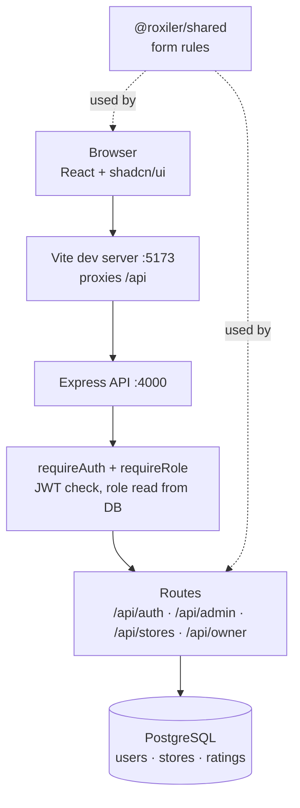
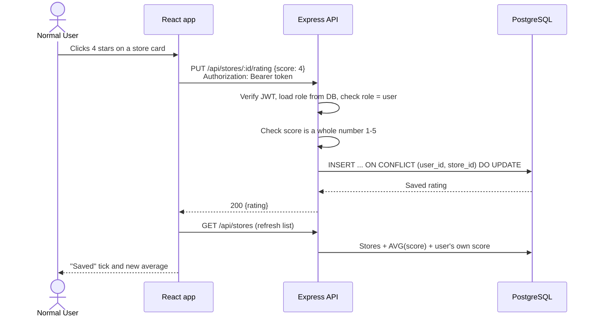
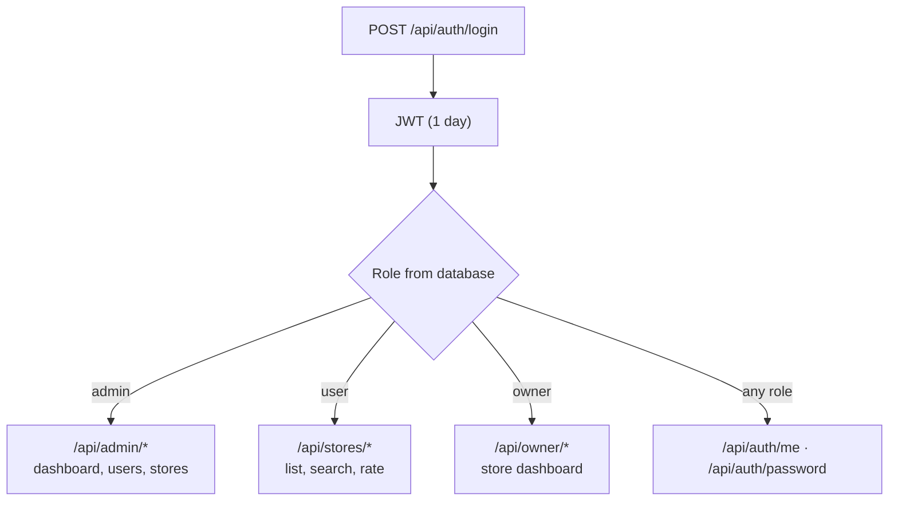
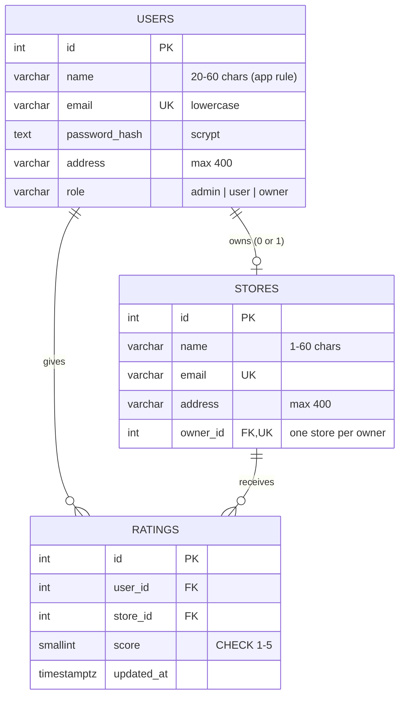

# Store Ratings

A full-stack web app where users rate stores from 1 to 5. One login serves three roles: **System Administrator**, **Normal User** and **Store Owner**. Each role sees its own dashboard.

Built for the Roxiler Systems FullStack Intern Coding Challenge.

## Demo logins

| Role | Email | Password |
|---|---|---|
| System Administrator | `admin@example.com` | `123456` |
| Normal User | `user@example.com` | `123456` |
| Store Owner | `owner@example.com` | `123456` |

> These are demo accounts with a simple password, set directly in the database. Any **new** password (signup, admin "Add user", or "Change password") must follow the password rule below.

## Tech stack

| Layer | Choice |
|---|---|
| Frontend | React 19, Vite, Tailwind CSS v4, shadcn/ui (Radix), lucide icons |
| Backend | Node.js, Express 5, JWT auth |
| Database | PostgreSQL (Neon in the cloud, or local Docker) |
| Tooling | npm workspaces (monorepo), Node's built-in test runner, oxlint |

## Features

**System Administrator**
- Dashboard with total users, stores and ratings (cards open the matching list)
- Add users (any role) and stores (optionally linked to a store owner)
- List users and stores, with filters on name, email, address and role
- Sort every list ascending or descending
- View user details, including the store rating for store owners

**Normal User**
- Sign up and log in
- Browse all stores and search by name and address
- See each store's overall rating and their own rating
- Submit a rating from 1 to 5, and change it later

**Store Owner**
- Dashboard with the store's average rating, total ratings and latest rating
- List of users who rated the store, with their scores (sortable)

**Every role**
- Change password and log out from the profile menu

## Form rules

The same rules run in the browser and on the server (`packages/shared/validation.js`), and the database enforces them again with constraints.

| Field | Rule |
|---|---|
| Name | 20 to 60 characters |
| Address | Required, up to 400 characters |
| Password | 8 to 16 characters, at least one uppercase letter and one special character |
| Email | Standard email format, stored in lowercase, unique |
| Rating | Whole number from 1 to 5, one rating per user per store |

## Architecture

### System overview



### How a request flows (example: a user rates a store)



### Role-based access



### Database schema



- `UNIQUE (user_id, store_id)` on ratings: a user can rate a store only once, and changing a rating updates that row.
- Deleting a user removes their ratings. Deleting an owner keeps the store (`owner_id` becomes empty).
- Averages and counts are calculated in SQL, so they are always current.

### Folder structure

```
.
├── apps/
│   ├── backend/              Express API
│   │   ├── db/               schema.sql, setup.js, create-admin.js
│   │   ├── src/
│   │   │   ├── routes/       auth, admin, stores (user), owner
│   │   │   ├── middleware/   requireAuth, requireRole
│   │   │   └── utils/        password hashing, safe filter/sort builder
│   │   └── test/             integration tests (real database)
│   └── frontend/             React app
│       └── src/
│           ├── pages/        AuthPage, AdminPage, UserPage, OwnerPage
│           ├── components/   DataList, StatCard, ProfileMenu, ui/ (shadcn)
│           ├── hooks/        useList (fetch + sort), useForm (validation)
│           └── lib/          API client
├── packages/
│   └── shared/               form rules shared by both apps
└── docker-compose.yml        optional local PostgreSQL
```

## API

All routes start with `/api`. Protected routes need `Authorization: Bearer <token>`.

| Method | Route | Who | Purpose |
|---|---|---|---|
| POST | `/auth/signup` | Public | Create a normal user |
| POST | `/auth/login` | Public | Log in, get a token |
| GET | `/auth/me` | Any role | Current user |
| PATCH | `/auth/password` | Any role | Change password |
| GET | `/admin/dashboard` | Admin | Total users, stores, ratings |
| GET | `/admin/users` | Admin | List users (filter + sort) |
| GET | `/admin/users/:id` | Admin | User details (+ rating for owners) |
| POST | `/admin/users` | Admin | Add a user with any role |
| GET | `/admin/stores` | Admin | List stores (filter + sort) |
| POST | `/admin/stores` | Admin | Add a store |
| GET | `/stores` | Normal user | List and search stores with ratings |
| PUT | `/stores/:id/rating` | Normal user | Submit or change a rating |
| GET | `/owner/dashboard` | Store owner | Average rating and raters |

List routes accept `?sort=<field>&order=asc|desc` and filters such as `?name=` and `?address=`. Sort fields come from an allowed list, and search text is matched literally, so query parameters never become SQL.

## Security

- Passwords are hashed with scrypt (Node's built-in `crypto`). They are never returned by the API.
- JWT tokens use HS256 with a 1-day expiry. The user's role is read from the database on every request, so a deleted or changed account loses access at once.
- Signup always creates a normal user. A role sent by the browser is ignored.
- All SQL uses bound parameters.

## Run it locally

**Needs:** Node.js 22.9 or newer, and a PostgreSQL database (Neon, or Docker).

1. Install packages.
   ```bash
   npm install
   ```
2. Create the env file and fill it in.
   ```bash
   cp apps/backend/.env.example apps/backend/.env
   ```
   | Variable | Meaning |
   |---|---|
   | `DATABASE_URL` | PostgreSQL connection string |
   | `JWT_SECRET` | Long random string for signing tokens |
   | `PORT` | API port (default `4000`) |

   To use local Docker instead of Neon, run `npm run db:up` and keep the default `DATABASE_URL`.
3. Create the tables.
   ```bash
   npm run db:setup
   ```
4. Create the first admin. The command asks for name, email, address and password, and saves them to the database.
   ```bash
   npm run create-admin
   ```
5. Start both servers, each in its own terminal.
   ```bash
   npm run dev:backend
   npm run dev:frontend
   ```
6. Open http://localhost:5173.

## Scripts

| Command | What it does |
|---|---|
| `npm run db:up` | Start local PostgreSQL in Docker (optional) |
| `npm run db:setup` | Create or update the tables (safe to run again) |
| `npm run create-admin` | Add an admin account from the terminal |
| `npm run dev:backend` | Start the API on port 4000 |
| `npm run dev:frontend` | Start the React app on port 5173 |
| `npm test` | Run 28 backend integration tests against the database |
| `npm run lint` | Lint backend and frontend |

The tests create their own users and stores, then delete them, so they are safe to run on a shared database.
